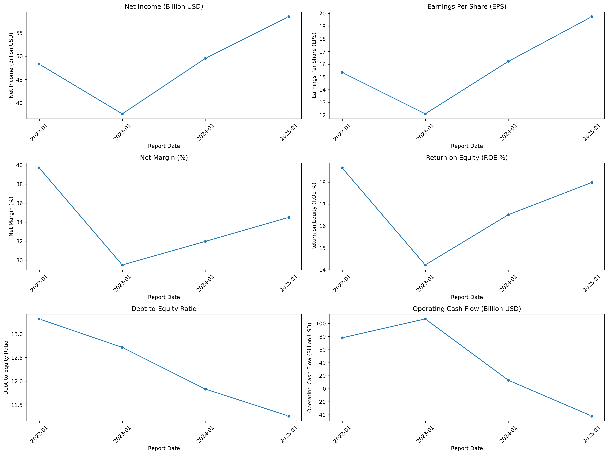

# 🏦 JPMorgan vs Bank of America: Financial Analysis

This project presents a comparative analysis of two major U.S. banks — JPMorgan Chase and Bank of America — using real financial data. I used Python, SQL, and Jupyter Notebooks to calculate and visualize key performance metrics.

### 📊 Metrics Visualized

- **Net Income** (Billion USD)  
- **Earnings Per Share (EPS)**  
- **Net Margin (%)**  
- **Return on Equity (ROE)**  
- **Operating Cash Flow** (Billion USD)  
- **Debt-to-Equity Ratio**

## 📁 Files

- [📓 JPM Graphs Notebook](JPM%20graphs.ipynb) – Visual comparison notebook
- [📥 Data Import & Cleaning](downloading%20data.ipynb) – Data import and cleaning
- PNG graphs – Visual summaries of each metric:
### 📊 Graph Visualizations

#### 🟦 Net Income Comparison  
  

**Why this metric?**  
Net income represents the company’s total profit after all expenses and taxes. It’s a core indicator of financial health and profitability.  

**What it shows:**  
This graph shows how JPMorgan consistently generates higher net income than Bank of America. You can observe profitability trends and the effect of market conditions over time.

---

#### 📈 EPS Comparison  
  

**Why this metric?**  
EPS measures the portion of profit allocated to each share, a key figure for investors.  

**What it shows:**  
It highlights shareholder value trends. JPMorgan’s higher EPS reflects stronger returns per share compared to BAC.

---

#### 💹 Net Margin Comparison  
  

**Why this metric?**  
Net margin = (Net Income / Revenue) × 100. It shows profit efficiency per dollar of revenue.  

**What it shows:**  
JPMorgan’s higher net margin implies better cost control or stronger pricing power than Bank of America.

---

#### 📈 Return on Equity (ROE) Comparison  
  

**Why this metric?**  
ROE = (Net Income / Equity) × 100. It measures how effectively a bank uses investor capital.  

**What it shows:**  
JPMorgan shows superior returns on equity, signaling stronger profitability and more efficient use of shareholder funds.

---

#### 💵 Operating Cash Flow Comparison  
  

**Why this metric?**  
Operating cash flow shows the cash generated by core operations, unaffected by accounting tricks.  

**What it shows:**  
JPMorgan generally converts more income into usable cash, indicating stronger liquidity and operational strength.

---

#### 🏦 Debt-to-Equity Ratio Comparison  
  

**Why this metric?**  
This ratio measures leverage and financial risk.  

**What it shows:**  
A higher ratio might signal more aggressive financing. Comparing the banks reveals how each approaches risk and capital structure.

## ❓Why These Metrics?i

These KPIs are essential for evaluating a bank’s:

- Profitability – Net income and EPS reflect the company’s financial performance and shareholder return.
- Efficiency – Net margin and ROE highlight how well a bank utilizes its assets and equity.
- Liquidity & Stability – Operating cash flow and debt-to-equity ratio assess financial health and risk.
- They are widely used by financial analysts, investors, and institutions.

## 🧠 Why JPMorgan and Bank of America?

These are the two largest U.S. banks by assets, but they differ in:

- Strategy – JPMorgan takes a more aggressive investment approach, while Bank of America is more conservative.
- Revenue Streams – JPM has stronger investment banking operations; BAC is more retail-focused.
- Performance – Comparing them reveals insights into how different strategies affect financial outcomes.

## ⚙️ Tools & Technologies

- Python (pandas, seaborn, matplotlib)
- JupyterLab
- SQL (PostgreSQL)
- yFinance (Yahoo Finance API) for data collection

## 🙋‍♀️ Author

**Mickey** 

Aspiring Data Analyst | Interested in Finance & Business Analytics  
📫 [keyroll020922@gmail.com](mailto:keyroll020922@gmail.com)

